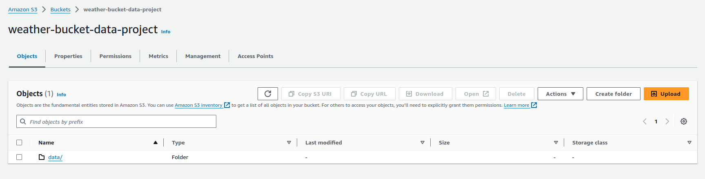

# weather-projects

0. [Entorno Virtual](#schema0)
1. [Archivo .env](#schema1)
2. [Claves de AWS](#schema2)
3. [Esctructura del proyecto](#schema3)
4. [Limpieza de Datos utilizando AWS Lambda](#schema4)

<hr>

<a name="schema0"></a>

## 1. Creación y Activación del Entorno Virtual
### **Crear un Entorno Virtual:**

Abre tu terminal y navega hasta el directorio de tu proyecto (donde deseas crear el entorno virtual).

```bash

cd /ruta/a/tu/proyecto
```
Luego, ejecuta el siguiente comando para crear un nuevo entorno virtual con virtualenv. Puedes reemplazar nombre_del_entorno con el nombre que desees para tu entorno virtual:

```bash
virtualenv weather-projects // nombre de ejemplo
```
Esto creará un directorio llamado weather-projects que contiene todo lo necesario para funcionar como un entorno virtual de Python.

### **Activar el Entorno Virtual:**

Una vez que hayas creado el entorno virtual, necesitas activarlo. La forma de activar el entorno virtual depende del sistema operativo:

En macOS y Linux:

En la carpeta de tu proyecto, ejecuta:

```bash

source weather-projectsl/bin/activate
```

### **Verificación:**

Cuando el entorno virtual se active correctamente, verás que el nombre del entorno virtual aparece antes del prompt en tu terminal. Por ejemplo:

```bash

(weather-projects) usuario@hostname:/ruta/a/tu/proyecto$
```

<hr>

<a name="schema1"></a>

## 1. Crear archivo .env

### Paso 1: Instalar python-dotenv
Primero, asegúrate de tener activado tu entorno virtual. Luego, instala la biblioteca python-dotenv:

```bash
pip install python-dotenv
```
### Paso 2: Crear el Archivo .env
En el directorio raíz de tu proyecto, crea un archivo llamado .env. Este archivo contendrá tus variables de entorno. Por ejemplo:

```makefile
API_KEY=tu_api_key_aqui
DB_HOST=tu_host_de_base_de_datos
DB_USER=tu_usuario_de_base_de_datos
DB_PASSWORD=tu_contraseña_de_base_de_datos
```
### Paso 3: Cargar el Archivo .env en Tu Script Python
Dentro de tu script Python, utiliza python-dotenv para cargar las variables de entorno desde el archivo .env. Aquí tienes un ejemplo de cómo hacerlo:

```python
import os
from dotenv import load_dotenv

# Cargar las variables de entorno desde el archivo .env
load_dotenv()

# Acceder a las variables de entorno
api_key = os.getenv('API_KEY')
db_host = os.getenv('DB_HOST')
db_user = os.getenv('DB_USER')
db_password = os.getenv('DB_PASSWORD')

# Usar las variables de entorno en tu código
print(f"API Key: {api_key}")
print(f"Database Host: {db_host}")
print(f"Database User: {db_user}")
```
### Paso 4: Ocultar el archivo .env a git

Añadir al archivo `.gitignore` el archivo `.env` para tener protegidas las claves y no subirlas a git


<hr>

<a name="schema2"></a>

## 2. Claves de AWS

1. Crear cuenta de amazon
2. Crear usuario no root.
3. Si ya se han usado el usario anterior y no te acuerdad de las claves `aws_access_key_id` y `aws_secret_access_key` usar el siguiente comando para buscar la configuración de AWS
```bash
ls ~/.aws
```
Deberían aparecer las siguientes carpetas
```bash
config  credentials
```
4. Abrir el visual con en esa ruta
```bash
code ~/.aws
```
5. Copiar las crendeciales a un archivo `.env`


<hr>

<a name="schema3"></a>

## 3. Esctructura del proyecto

1. Requisitos del Proyecto
- Lenguaje de programación: Python
- Proveedor de nube: AWS
- Tareas principales:
    - Extracción de datos desde una API
    - Limpieza de datos
    - Almacenamiento y exposición de resultados en AWS
2. Arquitectura del Proyecto
- Extracción de Datos:
    - Utilizaremos la API pública de OpenWeatherMap para obtener datos meteorológicos.

- Limpieza de Datos:

    - Implementaremos una función Lambda en AWS para la limpieza y transformación de datos.
- Almacenamiento y Exposición de Resultados:
    - Guardaremos los datos limpios en una base de datos gestionada por AWS (por ejemplo, Amazon RDS) y utilizaremos Amazon QuickSight para la visualización de datos.


<hr>

<a name="schema4"></a>

## 4. Limpieza de Datos utilizando AWS Lambda

### **Paso 0: Crear un bucket s3 para guardar los datos limpios

- **A. Crear un Bucket en Amazon S3**
    1. Navegar a la Consola de Amazon S3:

    2. Crear un Nuevo Bucket:

        Haz clic en "Create bucket".
Asigna un nombre único a tu bucket (por ejemplo, my-weather-data-bucket-clean).
Configura las opciones necesarias y crea el bucket.


### **Paso 1: Crear la Función Lambda**
- **A. Crear la Función Lambda en AWS**
    1. Navegar a la Consola de AWS Lambda:
    2. Crear una Nueva Función:
        Haz clic en "Create function".
        - Selecciona "Author from scratch".
        - Asigna un nombre a tu función (por ejemplo, `WeatherDataCleaner`).
        - Selecciona el runtime como `Python 3.8` (o la versión que prefieras).
        - Selecciona o crea un rol de ejecución con permisos necesarios (ver sección de permisos más abajo).
    3. Configurar el Código de la Función:

        - En la sección de "Function code", copia y pega el código proporcionado en el editor de código de Lambda.[Este código](./data-cleaning-lambda/lambda_function.py)
### **Paso 2: Configurar Permisos y Roles**
- **A. Crear un Rol de IAM para la Función Lambda**
    1. Navegar a la Consola de IAM:

    2. Crear un Nuevo Rol:

        - Haz clic en "Roles" y luego en "Create role".
        - Selecciona "Lambda" como el tipo de entidad de confianza.
        - Adjunta las políticas gestionadas por AWS: `AmazonS3FullAccess` y `AWSLambdaBasicExecutionRole`.
    3. Asignar el Rol a la Función Lambda:

        - Regresa a la consola de Lambda y asigna este rol a tu función Lambda en la sección "Execution role".

### **Paso 4: Configurar un Trigger en S3**
1. Agregar un Trigger en la Función Lambda:
    - En la consola de Lambda, en la configuración de tu función, haz clic en "Add trigger".
    - Selecciona "S3" como la fuente del trigger.
    - Selecciona el bucket que contenga los datos `weather-bucket-data-project`.
    - Configura el evento para que se active en "ObjectCreated (All)".
    - Crear una **variable de entorno** en la lambda con el bucket donde se va a guardar los datos `my-weather-data-bucket-clean`
    - Guarda la configuración.


Bucket `weather-bucket-data-project`




Bucket `my-weather-data-bucket-clean`


